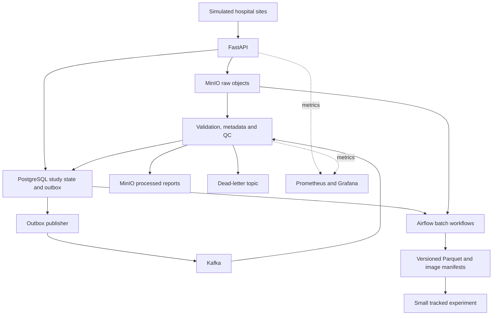

# MedStream
## Cloud-Native Clinical Imaging Data Platform

MedStream is a portfolio data engineering project exploring reliable,
event-driven ingestion and processing of multi-site MRI studies.

Its goal is to turn imaging files and study metadata into validated,
traceable, versioned inputs for analytics and downstream machine learning.

**Current status:** Phase 1 — repository foundation.
No application services are implemented yet.

## Planned technology stack

Python, FastAPI, Apache Kafka, PostgreSQL, MinIO, Apache Airflow,
Parquet, Prometheus, Grafana, Docker Compose and pytest.

MLflow is planned for a small downstream experiment.
Google Cloud Pub/Sub is an optional messaging extension.

## Running the project

The repository currently contains scaffolding only.
There is no runnable platform or Docker Compose configuration yet.

Setup, execution and expected outputs will be documented as each
working milestone is completed.

## Planned architecture

## Planned data flow

1. Simulated sites submit MRI files and a study manifest.
2. Completed uploads are recorded with a transactional outbox event.
3. Kafka delivers object references to the validation worker.
4. The worker validates files, extracts metadata and records QC.
5. Permanent failures are preserved for inspection and controlled replay.
6. Airflow builds versioned datasets from eligible studies.
7. A small MLflow experiment demonstrates downstream dataset use.

## Dataset and provenance

A selected BraTS release will provide a local subset of 10–30 subjects.
Acquisition and redistribution must follow that release's terms.

Hospital-site and unavailable scanner metadata will be synthetic and
explicitly labelled. BraTS files will not be committed to this repository.

Automated tests will use small synthetic NIfTI volumes.

## Skills demonstrated

The following mappings are planned, not implemented:

| Skill | Planned evidence |
|---|---|
| Event-driven engineering | Kafka events, partitions and consumer groups |
| Reliability | Idempotency, bounded retries, outbox and dead-letter replay |
| Relational modelling | Constraints, indexes, migrations and transactions |
| Imaging data engineering | NIfTI validation and object manifests |
| Batch processing | Airflow workflows and versioned Parquet datasets |
| Governance | Provenance, pseudonymous IDs and audit history |
| Observability | Structured logs, metrics and Grafana dashboard |
| Software quality | pytest, integration checks, Docker and CI |
| MLOps | Dataset-linked MLflow experiment |

## Documentation

Architecture, data model, event contracts, governance and demonstration
instructions will be added incrementally under docs/.

## Testing

No automated tests exist in Phase 1.
Each implementation milestone will include reproducible validation.

## Demonstration evidence

API, Airflow and Grafana screenshots will be added after the corresponding
components run successfully. No screenshots or runtime claims exist yet.

## Design decisions

- Object storage holds imaging files and exported artifacts.
- PostgreSQL is the authoritative source of transactional study state.
- Kafka messages carry references rather than imaging bytes.
- Variable QC reports initially use PostgreSQL JSONB.
- Airflow orchestrates finite batch dataset-building workflows.
- Additional technologies require a demonstrated architectural need.

## Limitations

This is a portfolio demonstration using research and synthetic data.
It is not a validated clinical system and makes no HIPAA, GDPR, FDA
or GxP compliance claims.

## Roadmap

- Phase 1: repository foundation
- Subsequent milestones: ingestion, validation and PostgreSQL, object
  storage, Airflow, observability, curated datasets and MLflow
- Optional extension: Pub/Sub messaging adapter
- Final release: reproducible demo, verified documentation and evidence
